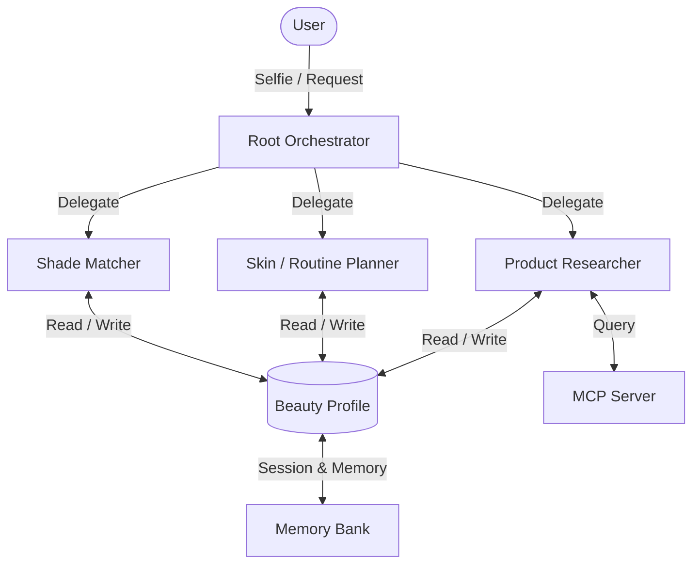

# Jamalek

Jamalek ("your beauty" in Arabic) is a beauty assistant that keeps track of your skin. You show it a selfie or tell it what your skin is doing that day, and it takes you from skincare prep through to a finished makeup look, pulling from products you already own before it suggests buying anything new.

Built for the Google x Kaggle 5-Day AI Agents Intensive capstone, Concierge track. Framework is Google's ADK (Python), models are Gemini.

## Why I built it

Most beauty tools are stateless. You ask "what foundation suits me" and it answers from scratch every time. No idea about your undertone, no memory that something broke you out last month, no clue you already own three foundations. So it points you at whatever's trending and a checkout page.

The interesting part isn't matching a shade once. It's an assistant that builds up a picture of you over time and reasons about what's already in your bag.

## What it does

- Reads undertone and skin concerns (dryness, oiliness, breakouts) from a selfie using Gemini vision, and suggests a prep step first.
- Matches shades to your undertone and plans a look, checking what you already own before recommending anything new.
- Finds cheaper dupes when you actually need something new ("a $12 version of this $48 foundation") by looking them up over MCP.
- Remembers all of it (undertone, inventory, breakout history) between sessions.

## Architecture



A root agent decides which specialist to hand off to. The three sub-agents share one beauty profile that lives in ADK's session state, with Memory Bank holding the long-term parts. Product data comes in through a read-only MCP server, so the agent can't reach past the catalog.

## Course concepts

The capstone needs at least three concepts from the course. Jamalek uses five in the code, plus two more shown in the video:

- **Multi-agent (ADK)** — root orchestrator plus three specialist sub-agents.
- **MCP server** — read-only product/dupe catalog lookup.
- **Agent skills** — each capability is a SKILL.md folder, loaded only when it's needed.
- **Sessions + long-term memory** — the beauty profile persists across sessions via session state and Memory Bank.
- **Security** — selfies handled ephemerally, human confirmation before any write or purchase (see `SECURITY.md`).
- **Antigravity and deployability** — shown in the video, deploying to Cloud Run.

## Running it

Needs Python 3.10+ and a Gemini API key from AI Studio. Keys go in environment variables. Nothing sensitive is committed.

```bash
git clone https://github.com/<you>/jamalek.git
cd jamalek

python -m venv .venv && source .venv/bin/activate
pip install -r requirements.txt

export GEMINI_API_KEY="your-key-here"

# start the MCP product server
python mcp_server/server.py

# run the agent
adk web            # ADK dev UI
# or: adk run shade_concierge
```

Upload a selfie or describe your skin, and the root agent takes it from there.

## Deploying (optional)

```bash
gcloud run deploy jamalek \
  --source . \
  --region us-central1 \
  --allow-unauthenticated \
  --set-env-vars GEMINI_API_KEY=$GEMINI_API_KEY
```

The key is passed in at runtime, never baked into the image.

## Layout

```
jamalek/
├── agents/             # root orchestrator & sub-agents
│   ├── orchestrator.py
│   ├── skin_analyst.py
│   ├── shade_matcher.py
│   ├── routine_planner.py
│   └── product_researcher.py
├── mcp_server.py       # read-only catalog tool
├── memory.py           # profile and memory logic
├── templates/          # web frontend
│   └── index.html
├── data/
│   └── products.json
├── skills/             # SKILL.md per capability
├── Dockerfile
├── SECURITY.md
├── README.md
└── requirements.txt
```

## Security

Selfies aren't stored, only the undertone label they produce. Anything that writes to memory or looks like a purchase asks you first. Details are in `SECURITY.md`.

## Demo

- **Video**: <VIDEO_LINK>
- **Live (Cloud Run)**: https://jamalek-724220720710.us-central1.run.app
