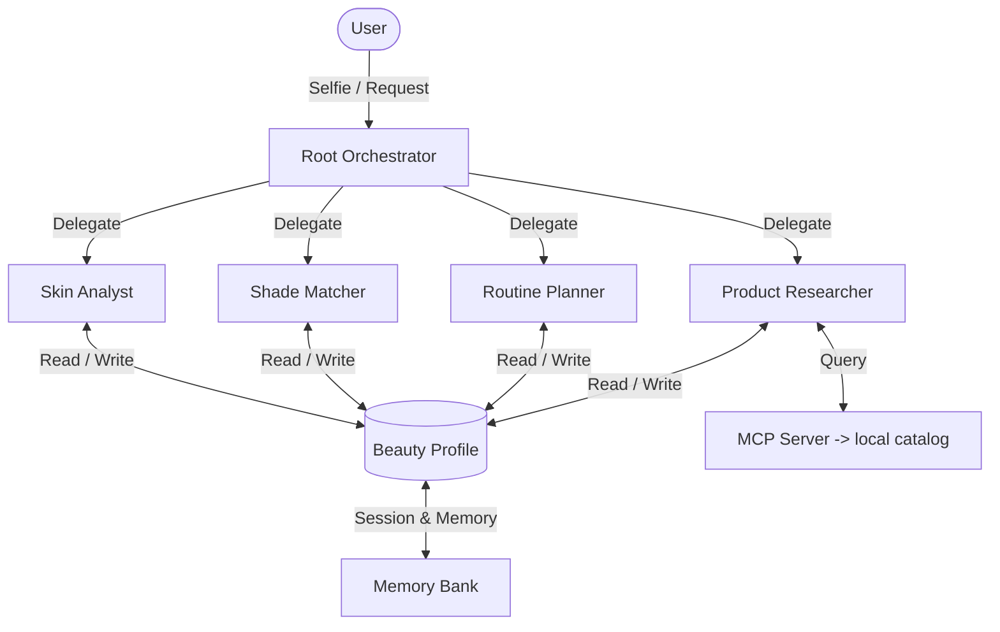

# Jamalek


Most online beauty quizzes start from scratch every single time you use them. They do not remember your skin type, what products you already own, or if a specific ingredient broke you out last week. 

I built Jamalek ("your beauty" in Arabic) to fix this. It is a beauty assistant that keeps track of your skin over time. You drop a selfie or tell it what your skin is doing, and it guides you from skincare prep to a finished makeup look. It checks the products you already own before suggesting you buy anything new, and if you do need a new product, it finds cheaper dupes.

## How it works

The backend uses a root coordinator that passes requests to four specialized agents depending on what you ask:
- **Skin analysis**: Inspects your selfie for redness or active breakouts using Gemini Vision, and flags ingredients that might conflict.
- **Shade matching**: Figures out your foundation and concealer shade based on undertone details and jewelry preferences.
- **Routine planning**: Sequences your owned and recommended products in the correct morning and evening application order.
- **Product research**: Searches a local catalog for cheaper dupes by matching active ingredients and price points.

## Architecture



A root agent decides which specialist to hand off to. The sub-agents share one beauty profile that lives in ADK's session state, with Memory Bank holding the long-term parts. Product data comes in through a read-only MCP server, so the agent can't reach past the catalog.

## Key features

- **Memory and privacy**: It remembers your skin profile and makeup bag between sessions. If it extracts a new fact about your skin during chat, it asks for permission before saving it to your profile. You can also wipe your data at any time by typing "delete my profile".
- **Drag and drop**: You can drag a photo directly onto the browser window. It displays an overlay, attaches the image, and renders it directly inside the chat log.
- **Local catalog lookup**: Product lookup is handled through a Model Context Protocol (MCP) server. The agent queries a local database to fetch matches, which prevents it from hallucinating fake recommendations.

## Running it

Needs Python 3.10+ and a Gemini API key from AI Studio. Keys go in environment variables.

```bash
git clone https://github.com/lailabasyouni1000-cyber/jamalek.git
cd jamalek

python3 -m venv .venv && source .venv/bin/activate
pip install -r requirements.txt

export GEMINI_API_KEY="your-key-here"
export GOOGLE_API_KEY="your-key-here"

# start the Flask web application (automatically hosts orchestrator and triggers MCP tool subprocesses)
python app.py
```

Drag and drop a selfie or tell Jamalek about your skin to get started!

## Deploying

```bash
gcloud run deploy jamalek \
  --source . \
  --region us-central1 \
  --allow-unauthenticated \
  --set-env-vars GEMINI_API_KEY=$GEMINI_API_KEY,GOOGLE_API_KEY=$GOOGLE_API_KEY
```

The key is passed in at runtime, never baked into the container.

## Layout

```
jamalek/
├── agents/             # Root orchestrator & sub-agents
│   ├── orchestrator.py
│   ├── skin_analyst.py
│   ├── shade_matcher.py
│   ├── routine_planner.py
│   └── product_researcher.py
├── data/               # Product catalog database
│   └── products.json
├── skills/             # Instruction skills loaded by agents
│   ├── product_researcher.md
│   ├── routine_planner.md
│   ├── shade_matcher.md
│   └── skin_analyst.md
├── templates/          # Web frontend template
│   └── index.html
├── app.py              # Main Flask application
├── mcp_server.py       # Catalog query tool (Stdio MCP server)
├── memory.py           # Profile loading and saving logic
├── Dockerfile          # Container specification
├── SECURITY.md         # Data privacy and safety statement
├── README.md
└── requirements.txt
```

## Security

Selfies are processed purely in-memory and are never stored on disk. Anything that updates your profile asks you for consent first (consent gate). Details are in [SECURITY.md](SECURITY.md).

## Demo

- **Video**: <VIDEO_LINK>
- **Live (Cloud Run)**: https://jamalek-724220720710.us-central1.run.app
