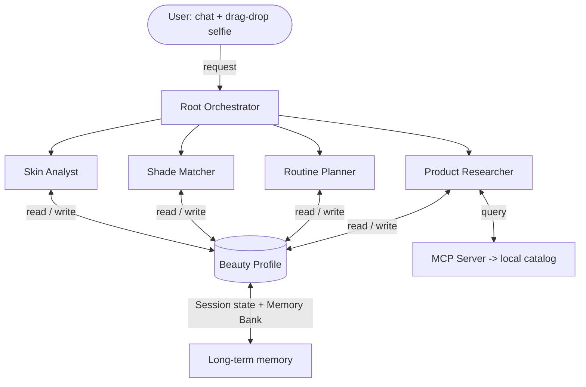

# Jamalek (جمالك)

Jamalek ("your beauty" in Arabic) is a stateful, multi-agent beauty assistant. You drag in a selfie and ask about your skin, and it reads your undertone, matches you to products at every price point, and remembers you between sessions.
 
- **link:** https://jamalek-724220720710.us-central1.run.app
- **Track:** Concierge Agents
## Why I built it
 
Most beauty tools online are stateless. They start over every time. They do not remember your skin, what you already own, or that an ingredient broke you out last week. So they give everyone the same generic advice and point them at a store.
 
Jamalek fixes that. It builds a profile of you over time, gives you real options at every price point instead of one overpriced product, and asks for your consent before saving anything.
 
## How it works
 
A root coordinator passes each request to one of four specialized agents:
 
- **Skin Analyst** reads your selfie with Gemini Vision and flags ingredient conflicts.
- **Shade Matcher** confirms your undertone and depth.
- **Routine Planner** sequences products into the correct morning and evening order.
- **Product Researcher** searches a local catalog for matched products across price tiers.
The four agents share one beauty profile, held in ADK session state with Memory Bank for the long-term parts. Product data comes through a read-only MCP server, so recommendations come from a real catalog and cannot be hallucinated. Before saving any new fact, Jamalek asks for consent, and you can wipe your data by typing `delete my profile`.
 
## Architecture
 

 
## Getting started
 
You need Python 3.10+ and a Gemini API key from AI Studio (set as both `GEMINI_API_KEY` and `GOOGLE_API_KEY`). Keys go in environment variables, never in the code.
 
```bash
git clone https://github.com/lailabasyouni1000-cyber/jamalek.git
cd jamalek
 
python3 -m venv .venv && source .venv/bin/activate
pip install -r requirements.txt
 
export GEMINI_API_KEY="your-key-here"
export GOOGLE_API_KEY="your-key-here"
 
# starts the Flask app (hosts the orchestrator and launches the MCP tool subprocess)
python app.py
```
 
Then drag a selfie onto the window, or tell Jamalek about your skin.
 
## Deploying
 
```bash
gcloud run deploy jamalek \
  --source . \
  --region us-central1 \
  --allow-unauthenticated \
  --set-env-vars GEMINI_API_KEY=$GEMINI_API_KEY,GOOGLE_API_KEY=$GOOGLE_API_KEY
```
 
Keys are passed in at runtime, never baked into the container.
 
## Security
 
Selfies are processed purely in memory and are never stored on disk. Anything that updates your profile asks for consent first. Details are in [SECURITY.md](SECURITY.md).
